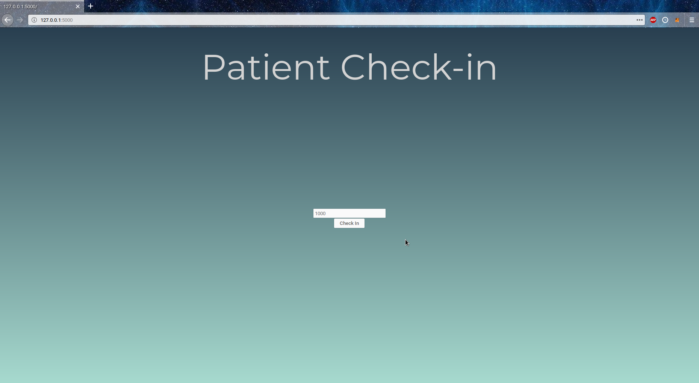
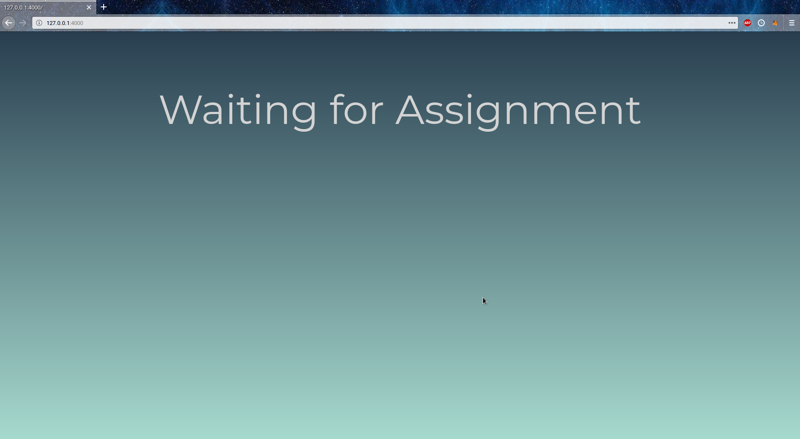
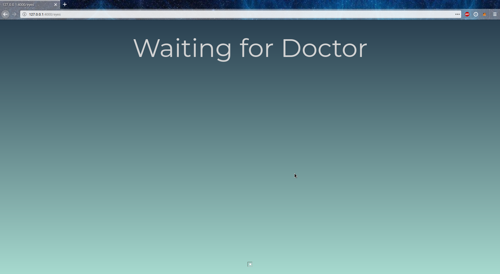
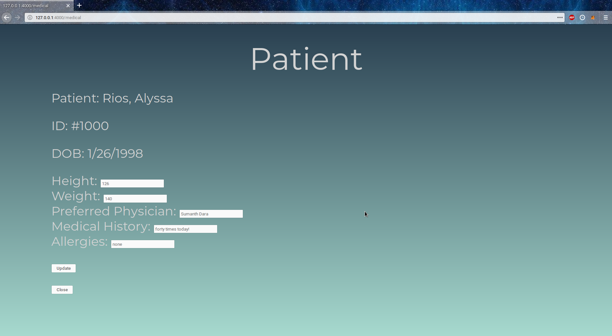
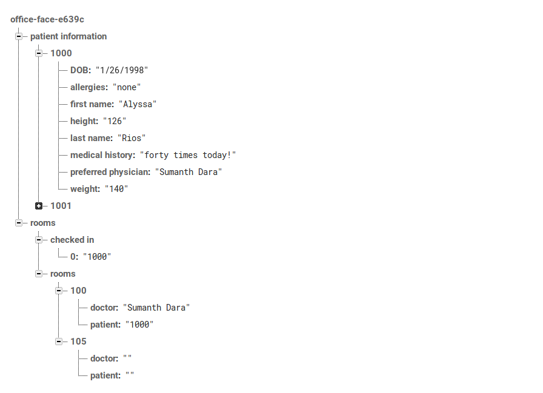

# FirstGlance

Patient check-in system made for UC Riverside's BioHack 2019.

See the Devpost listing [here](https://devpost.com/software/primafacie).

## Screenshots

**Front Desk** The front desk logs in a patient through a portal using their patient ID:

**Medical Room** Each medical room has a screen, FirstGlance manages room assignment and waits for a patient to be assigned to this room:

**Medical Room** When a patient is assigned to the room, the screen waits for the correct doctor to walk in:

**Medical Room** With the correct doctor, FirstGlance brings up the patient information:

**Backend** FirstGlance uses a Firebase backend for patient information and medical room management:

